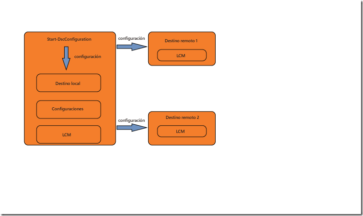
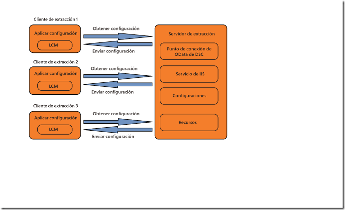

# Establecer configuraciones

>Se aplica a: Windows PowerShell 4.0, Windows PowerShell 5.0

Hay dos maneras de establecer las configuraciones de la configuración de estado deseado (DSC) de PowerShell: el modo de inserción y el modo de extracción.

## Modo de inserción

El modo de inserción se refiere a un usuario que aplica activamente una configuración a un nodo de destino mediante una llamada al cmdlet [Start-DscConfiguration](https://technet.microsoft.com/en-us/library/dn521623.aspx).

Después de crear y compilar una configuración, puede establecerla en el modo de inserción con una llamada al cmdlet [Start-DscConfiguration](https://technet.microsoft.com/en-us/library/dn521623.aspx), estableciendo el parámetro -Path del cmdlet en la ruta de acceso donde se encuentra el MOF de configuración. Por ejemplo, si el MOF de configuración está ubicado en `C:\DSC\Configurations\localhost.mof`, se aplicaría a la máquina local con el comando siguiente:
`Start-DscConfiguration -Path 'C:\DSC\Configurations'`

> __Nota__: De forma predeterminada, DSC ejecuta una configuración como un trabajo en segundo plano. Para ejecutar la configuración de forma interactiva, llame a [Start-DscConfiguration](https://technet.microsoft.com/en-us/library/dn521623.aspx) con el parámetro __-Wait__.

Los motores de implementación de la nube suelen aprovechar el modo de extracción dentro de una solución de implementación más amplia.  Por ejemplo, Microsoft Azure ofrece un [extensión de DSC](https://azure.microsoft.com/en-us/documentation/articles/virtual-machines-extensions-features/) para máquinas virtuales.  Esto ofrece la opción de incluir un script de configuración y todos los módulos de DSC necesarios en un archivo de almacenamiento que se extraiga y ejecute dentro de una máquina virtual como parte de una implementación.  

## Modo de extracción

En el modo de extracción, los clientes de extracción se configuran para obtener sus configuraciones de estado deseado desde un servidor de extracción remoto. Del mismo modo, el servidor de extracción se ha configurado para hospedar el servicio de DSC y se ha aprovisionado con las configuraciones y los recursos que necesitan los clientes de extracción.
Cada uno de los clientes de extracción tiene una tarea programada que realiza una comprobación periódica del cumplimiento de la configuración del nodo. Cuando el evento se desencadena por primera vez, provoca que el administrador de configuración local (LCM) del cliente de extracción valide la configuración. Si el cliente de extracción se configura como se desea, no ocurre nada. De lo contrario, el LCM envía una solicitud al servidor de extracción para obtener una configuración determinada. Si dicha configuración existe en el servidor de extracción y pasa las comprobaciones de validación iniciales, la configuración se transmite al cliente de extracción, donde a continuación el LCM la ejecuta.

Para más información sobre la implementación de un servidor de extracción de DSC local, consulte la Guía de planificación y configuración del servidor de extracción de DSC.

Si prefiere aprovechar un servicio en línea para hospedar la funcionalidad del servidor de extracción, consulte el servicio [DSC de Automatización de Azure](https://azure.microsoft.com/en-us/documentation/articles/automation-dsc-overview/).

En los temas siguientes se explica cómo configurar los clientes y servidores de extracción:

- [Configuración de un servidor de extracción web](pullServer.md)
- [Configuración de un servidor de extracción SMB](pullServerSMB.md)
- [Configuración de un cliente de extracción](pullClientConfigID.md)<!--HONumber=Feb16_HO4-->
