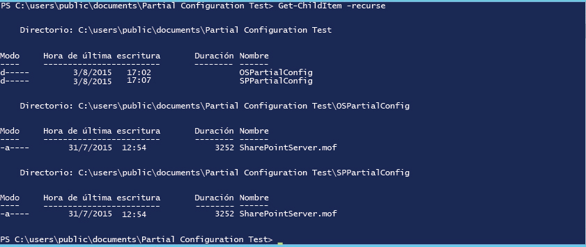

# Configuraciones parciales de la configuración de estado deseado de PowerShell

>Se aplica a: Windows PowerShell 5.0

En PowerShell 5.0, la configuración de estado deseado (DSC) permite que las configuraciones se entreguen en fragmentos y desde varios orígenes. El administrador de configuración local (LCM) en el nodo de destino reúne los fragmentos antes de aplicarlos como una configuración única. Esta capacidad permite compartir el control de la configuración entre equipos o usuarios. Por ejemplo, si dos o más equipos de desarrolladores colaboran en un servicio, es posible que cada uno de ellos prefiera crear configuraciones para administrar su parte del servicio. Cada una de estas configuraciones se podría extraer de servidores de extracción diferentes y se podría agregar en diferentes fases del desarrollo. Las configuraciones parciales también permiten que distintas personas o equipos controlen aspectos diferentes de los nodos de configuración, sin tener que coordinar la edición de un documento de configuración único. Por ejemplo, un equipo podría ser responsable de la implementación de una máquina virtual y un sistema operativo, mientras que otro equipo podría implementar otras aplicaciones y servicios en esa máquina virtual. Con las configuraciones parciales, cada equipo puede crear su propia configuración, sin que ninguna de ellas sea innecesariamente complicada.

Puede utilizar las configuraciones parciales en el modo de inserción, el modo de extracción o una combinación de ambos.

## Configuraciones parciales en el modo de inserción
Para utilizar configuraciones parciales en modo de inserción, debe configurar el LCM en el nodo de destino para que reciba las configuraciones parciales. Cada configuración parcial se debe insertar en el destino mediante el cmdlet Publish-DSCConfiguration. El nodo de destino combina entonces la configuración parcial en una configuración única, que puede aplicar mediante una llamada al cmdlet [Start-DscConfiguration](https://technet.microsoft.com/en-us/library/dn521623.aspx).

### Configurar el LCM para configuraciones parcial del modo de inserción
Para configurar el LCM para configuraciones parciales en el modo de inserción, debe crear una configuración **DSCLocalConfigurationManager** con un bloque **PartialConfiguration** para cada configuración parcial. Para más información sobre la configuración del LCM, consulte [Configuración del administrador de configuración local de Windows](https://technet.microsoft.com/en-us/library/mt421188.aspx). En el ejemplo siguiente se muestra una configuración de LCM que espera dos configuraciones parciales: una que implemente el sistema operativo y otra que implemente y configure SharePoint.

```powershell
[DSCLocalConfigurationManager()]
configuration PartialConfigDemo
{
    Node localhost
    {
        
           PartialConfiguration OSInstall
        {
            Description = 'Configuration for the Base OS'
            RefreshMode = 'Push'
        }
           PartialConfiguration SharePointConfig
        {
            Description = 'Configuration for the SharePoint server'
            RefreshMode = 'Push'
        }
    }
}
PartialConfigDemo 
```

El valor **RefreshMode** de cada configuración parcial se establece en "Push". Los nombres de los bloques **PartialConfiguration** (en este caso, "OSInstall" y "SharePointConfig") deben coincidir exactamente con los nombres de las configuraciones que se inserten en el nodo de destino.

### Publicación e inicialización de las configuraciones parciales del modo de inserción


Después llame a **Publish-DSCConfiguration** para cada configuración, pasando las carpetas que contengan los documentos de configuración como los parámetros Path. Después de publicar las dos configuraciones, puede llamar a `Start-DSCConfiguration –UseExisting` en el nodo de destino.

## Configuraciones parciales en el modo de extracción

Las configuraciones parciales pueden extraerse de uno o varios servidores de extracción (para más información sobre los servidores de extracción, consulte [Servidores de extracción de la configuración de estado deseado de Windows PowerShell](pullServer.md). Para ello, tendrá que configurar el LCM en el nodo de destino para extraer las configuraciones parciales, especificar un nombre y localizar los documentos de configuración correctamente en los servidores de extracción.

### Configurar el LCM para configuraciones del modo de extracción

Para configurar el LCM para extraer configuraciones parciales de un servidor de extracción, debe definir el servidor de extracción en un bloque **ConfigurationRepositoryWeb** (para un servidor de extracción HTTP) o **ConfigurationRepositoryShare** (para un servidor de extracción SMB). A continuación, cree bloques **PartialConfiguration** que hagan referencia al servidor de extracción mediante la propiedad **ConfigurationSource**. También debe crear un bloque **Settings** para especificar que el LCM usa el modo de extracción y para especificar los valores de **ConfigurationNames** o **ConfigurationID** que el servidor de extracción y el nodo de destino usan para identificar las configuraciones. La metaconfiguración siguiente define un servidor de extracción HTTP denominado CONTOSO-PullSrv y dos configuraciones parciales que usan dicho servidor de extracción.

Para obtener más información sobre cómo configurar el LCM mediante **ConfigurationNames**, consulte [Configuración de un cliente de extracción mediante nombres de configuración](pullClientConfigNames.md). Para obtener más información sobre cómo configurar el LCM mediante **ConfigurationID**, consulte [Configuración de un cliente de extracción mediante id. de configuración](pullClientConfigID.md).

#### Configurar el LCM para configuraciones de modo de extracción mediante nombres de configuración

```powershell
[DscLocalConfigurationManager()]
Configuration PartialConfigDemoConfigNames
{
        Settings
        {
            RefreshFrequencyMins            = 30;
            RefreshMode                     = "PULL";
            ConfigurationMode               ="ApplyAndAutocorrect";
            AllowModuleOverwrite            = $true;
            RebootNodeIfNeeded              = $true;
            ConfigurationModeFrequencyMins  = 60;
        }
        ConfigurationRepositoryWeb CONTOSO-PullSrv
        {
            ServerURL                       = 'https://CONTOSO-PullSrv:8080/PSDSCPullServer.svc'    
            RegistrationKey                 = 5b41f4e6-5e6d-45f5-8102-f2227468ef38     
            ConfigurationNames              = @("OSInstall", "SharePointConfig")
        }     
        
        PartialConfiguration Part1 
        {
            Description                     = "OSInstall"
            ConfigurationSource             = @("[ConfigurationRepositoryWeb]CONTOSO-PullSrv") 
        }
 
        PartialConfiguration SharePointConfig
        {
            Description                     = "SharePointConfig"
            ConfigurationSource             = @("[ConfigurationRepositoryWeb]CONTOSO-PullSrv")
            DependsOn                       = '[PartialConfiguration]OSInstall'
        }
   
}
``` 

#### Configurar el LCM para configuraciones de modo de extracción mediante ConfigurationID

```powershell
[DSCLocalConfigurationManager()]
configuration PartialConfigDemoConfigID
{
    Node localhost
    {
        Settings
        {
            RefreshMode                     = 'Pull'
            ConfigurationID                 = '1d545e3b-60c3-47a0-bf65-5afc05182fd0'
            RefreshFrequencyMins            = 30 
            RebootNodeIfNeeded              = $true
        }
        ConfigurationRepositoryWeb CONTOSO-PullSrv
        {
            ServerURL                       = 'https://CONTOSO-PullSrv:8080/PSDSCPullServer.svc'
            
        }
        
           PartialConfiguration OSInstall
        {
            Description                     = 'Configuration for the Base OS'
            ConfigurationSource             = '[ConfigurationRepositoryWeb]CONTOSO-PullSrv'
            RefreshMode                     = 'Pull'
        }
           PartialConfiguration SharePointConfig
        {
            Description                     = 'Configuration for the Sharepoint Server'
            ConfigurationSource             = '[ConfigurationRepositoryWeb]CONTOSO-PullSrv'
            DependsOn                       = '[PartialConfiguration]OSInstall'
            RefreshMode                     = 'Pull'
        }
    }
}
PartialConfigDemo 
```

Puede extraer configuraciones parciales de más de un servidor de extracción; solo sería necesario definir cada servidor de extracción y, después, hacer referencia al servidor de extracción adecuado en cada bloque PartialConfiguration.

Después de crear la metaconfiguración, debe ejecutar para crear un documento de configuración (archivo MOF) y, a continuación, llame a [Set-DscLocalConfigurationManager](https://technet.microsoft.com/en-us/library/dn521621(v=wps.630).aspx) para configurar el LCM.

### Nomenclatura y ubicación de los documentos de configuración en el servidor de extracción (ConfigurationNames)

Los documentos de configuración parcial deben ubicarse en la carpeta especificada en el valor **ConfigurationPath** del archivo `web.config` del servidor de extracción (normalmente `C:\Program Files\WindowsPowerShell\DscService\Configuration`). Los documentos de configuración deben nombrarse del modo siguiente: `ConfigurationName.mof`, donde _ConfigurationName_ es el nombre de la configuración parcial. En el ejemplo, los documentos de configuración deben nombrarse del modo siguiente:

```
OSInstall.mof
OSInstall.mof.checksum
SharePointConfig.mof
SharePointConfig.mof.checksum
```

### Nomenclatura y ubicación de los documentos de configuración en el servidor de extracción (ConfigurationID)

Los documentos de configuración parcial deben ubicarse en la carpeta especificada en el valor **ConfigurationPath** del archivo `web.config` del servidor de extracción (normalmente `C:\Program Files\WindowsPowerShell\DscService\Configuration`). Los documentos de configuración deben tener el siguiente nombre: _ConfigurationName_. _ConfigurationID_`.mof`, donde _ConfigurationName_ es el nombre de la configuración parcial y _ConfigurationID_ es el identificador de configuración definido en el LCM del nodo de destino. En el ejemplo, los documentos de configuración deben nombrarse del modo siguiente:

```
OSInstall.1d545e3b-60c3-47a0-bf65-5afc05182fd0.mof
OSInstall.1d545e3b-60c3-47a0-bf65-5afc05182fd0.mof.checksum
SharePointConfig.1d545e3b-60c3-47a0-bf65-5afc05182fd0.mof
SharePointConfig.1d545e3b-60c3-47a0-bf65-5afc05182fd0.mof.checksum
```


### Ejecución de configuraciones parciales de un servidor de extracción

Cuando se haya configurado el LCM en el nodo de destino y se hayan creado los documentos de configuración con los nombres correctos en el servidor de extracción, el nodo de destino extraerá las configuraciones parciales, las combinará y aplicará la configuración resultante a intervalos regulares, según especifique la propiedad **RefreshFrequencyMins** del LCM. Si quiere forzar una actualización, puede llamar al cmdlet [Update-DscConfiguration](https://technet.microsoft.com/en-us/library/mt143541.aspx) para extraer las configuraciones y luego a `Start-DSCConfiguration –UseExisting` para aplicarlas.


## Configuraciones parciales en los modos de inserción y extracción mixtos

También puede mezclar los modos de inserción y extracción para las configuraciones parciales. Es decir, podría tener una configuración parcial que se haya extraído de un servidor de extracción, mientras que otra configuración parcial se inserta. Trate cada configuración parcial como prefiera, según su modo de actualización, como se describe en las secciones anteriores. Por ejemplo, la metaconfiguración siguiente describe el mismo ejemplo, con la configuración parcial del sistema operativo en el modo de extracción y la configuración parcial de SharePoint en el modo de inserción.

### Modos de inserción y extracción mixtos mediante ConfigurationNames

```powershell
[DscLocalConfigurationManager()]
Configuration PartialConfigDemoConfigNames
{
        Settings
        {
            RefreshFrequencyMins            = 30;
            RefreshMode                     = "PULL";
            ConfigurationMode               = "ApplyAndAutocorrect";
            AllowModuleOverwrite            = $true;
            RebootNodeIfNeeded              = $true;
            ConfigurationModeFrequencyMins  = 60;
        }
        ConfigurationRepositoryWeb CONTOSO-PullSrv
        {
            ServerURL                       = 'https://CONTOSO-PullSrv:8080/PSDSCPullServer.svc'    
            RegistrationKey                 = 5b41f4e6-5e6d-45f5-8102-f2227468ef38     
            ConfigurationNames              = @("OSInstall", "SharePointConfig")
        }     
        
        PartialConfiguration OSInstall 
        {
            Description                     = "OSInstall"
            ConfigurationSource             = @("[ConfigurationRepositoryWeb]CONTOSO-PullSrv")
            RefreshMode                     = 'Pull' 
        }
 
        PartialConfiguration SharePointConfig
        {
            Description                     = "SharePointConfig"
            DependsOn                       = '[PartialConfiguration]OSInstall'
            RefreshMode                     = 'Push'
        }
   
}
``` 

### Modos de inserción y extracción mixtos mediante ConfigurationID

```powershell
[DSCLocalConfigurationManager()]
configuration PartialConfigDemo
{
    Node localhost
    {
        Settings
        {
            RefreshMode             = 'Pull'
            ConfigurationID         = '1d545e3b-60c3-47a0-bf65-5afc05182fd0'
            RefreshFrequencyMins    = 30 
            RebootNodeIfNeeded      = $true
        }
        ConfigurationRepositoryWeb CONTOSO-PullSrv
        {
            ServerURL               = 'https://CONTOSO-PullSrv:8080/PSDSCPullServer.svc'
            
        }
        
           PartialConfiguration OSInstall
        {
            Description             = 'Configuration for the Base OS'
            ConfigurationSource     = '[ConfigurationRepositoryWeb]CONTOSO-PullSrv'
            RefreshMode             = 'Pull'
        }
           PartialConfiguration SharePointConfig
        {
            Description             = 'Configuration for the Sharepoint Server'
            DependsOn               = '[PartialConfiguration]OSInstall'
            RefreshMode             = 'Push'
        }
    }
}
PartialConfigDemo 
```

Tenga en cuenta que el valor de **RefreshMode** especificado en el bloque Settings es "Pull", pero el valor de **RefreshMode** para configuración parcial de OSInstall es "Push".

Asigne un nombre y localice los archivos MOF de configuración tal y como se ha descrito anteriormente para sus modos de actualización correspondientes. Llame a **Publish-DSCConfiguration** para publicar la configuración parcial de `SharePointInstall` y, o bien esperar a que se extraiga la configuración `OSInstall` del servidor de extracción, o bien forzar una actualización mediante una llamada a [Update-DscConfiguration](https://technet.microsoft.com/en-us/library/mt143541(v=wps.630).aspx).

## Configuración parcial de OSInstall de ejemplo

```powershell
Configuration OSInstall
{
    Param (
        [Parameter(Mandatory,
                   HelpMessage="Domain credentials required to add domain\sharepoint_svc to the local Administrators group.")]
        [ValidateNotNullOrEmpty()]
        [pscredential]$Credential
    )

    Import-DscResource -ModuleName PSDesiredStateConfiguration


    Node localhost
    {
        Group LocalAdmins
        {
            GroupName           = 'Administrators'
            MembersToInclude    = 'domain\sharepoint_svc',
                                  'admins@example.domain'
            Ensure              = 'Present'
            Credential          = $Credential
            
        }

        WindowsFeature Telnet
        {
            Name                = 'Telnet-Server'
            Ensure              = 'Absent'
        }
    }
}
OSInstall

```
## Configuración parcial de SharePointConfig de ejemplo
```powershell
Configuration SharePointConfig
{
    Param (
        [Parameter(Mandatory)]
        [ValidateNotNullOrEmpty()]
        [pscredential]$ProductKey
    )

    Import-DscResource -ModuleName xSharePoint

    Node localhost
    {
        xSPInstall SharePointDefault
        {
            Ensure      = 'Present'
            BinaryDir   = '\\FileServer\Installers\Sharepoint\'
            ProductKey  = $ProductKey
        }
    }
}
SharePointConfig
```
##Consulte también 

**Conceptos**
[Servidores de extracción de la configuración de estado deseado de Windows PowerShell](pullServer.md) 
[Configuración del administrador de configuración local de Windows](https://technet.microsoft.com/en-us/library/mt421188.aspx) 


<!--HONumber=Jun16_HO4-->


