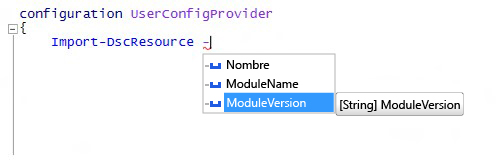

# La palabra clave Import-DscResource admite el parámetro -ModuleVersion

Hemos agregado un nuevo parámetro para la palabra clave dinámica `Import-DscResource`, que está disponible al crear configuraciones de DSC. Los autores de configuración pueden ahora especificar exactamente de qué versión del módulo se deben cargar los recursos de DSC. La nueva sintaxis de la palabra clave es:

```powershell
Import-DscResource [-Name <ResourceName(s)>] [-ModuleName <ModuleName(s)>] [-ModuleVersion <ModuleVersion>]
```

* **Name**: nombres de uno o más recursos que van a importar.
* **ModuleName**: nombres de módulo o de objetos ModuleSpecification de uno o más módulos que se van a importar.
* **ModuleVersion**: versión del módulo que se va a importar. Si se usa, ModuleName debe representar un solo módulo por el nombre. 

En Windows PowerShell ISE, se muestra con IntelliSense:



**Nota**: El parámetro `–ModuleVersion` solo puede usarse en combinación con el parámetro `–ModuleName`. No puede usarse con nombres de recursos usando solo el parámetro `–Name`.

Anteriormente, la única manera de especificar la versión del módulo al cargar los recursos de DSC era mediante el objeto de especificación del módulo, como `–ModuleName @{ModuleName="UserConfigProvider";ModuleVersion="3.0"}`

<!--HONumber=Mar16_HO2-->
