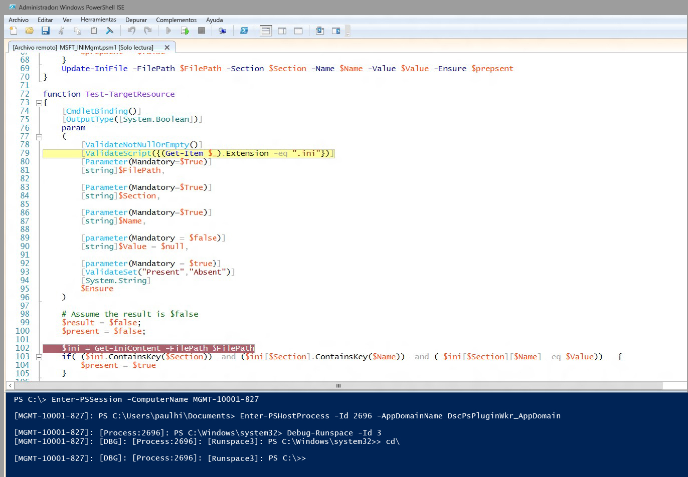

# Depuración de scripts de recursos de DSC
WMF 5.0 Production Preview incluye compatibilidad para depurar scripts de recursos de DSC mientras se ejecutan en nodos de destino. En las versiones anteriores de WMF 5.0, agregamos características de depuración de scripts avanzadas con las capacidades de conexión a procesos locales (Get-PSHostProcessInfo, Enter-PSHostProcessInfo, Exit-PSHostProcessInfo), enumeración de todos los espacios de ejecución en un proceso y depuración de un espacio de ejecución arbitraria en un proceso (Get-Runspace, Debug-Runspace).

La depuración de scripts de recursos de DSC se basa en este trabajo mediante la adición de dos nuevos cmdlets.

##Sintaxis
**Enable-DscDebug**
Enable-DscDebug \[-BreakAll\] \[-CimSession &lt;CimSession\[\]&gt;\] \[-ThrottleLimit &lt;int&gt;\] \[-AsJob\] \[-WhatIf\] \[-Confirm\] \[&lt;CommonParameters&gt;\]

**Disable-DscDebug**
Disable-DscDebug \[-CimSession &lt;CimSession\[\]&gt;\] \[-ThrottleLimit &lt;int&gt;\] \[-AsJob\] \[-WhatIf\] \[-Confirm\] \[&lt;CommonParameters&gt;\]

##Flujo de trabajo típico


```PowerShell
PS C:\Test> Enable-DscDebug –BreakAll

PS C:\Test> Start-DscConfiguration -path .\TestConfig2 -Wait -Verbose
VERBOSE: Perform operation 'Invoke CimMethod' with following parameters, ''namespaceName' = root/Microsoft/Windows/DesiredStateConfiguration,'className' = MSFT\_DSCLocalConfigurationManager,'methodName' = SendConfigurationApply'.
VERBOSE: An LCM method call arrived from computer MGMT-10001-827 with user sid S-1-5-21-397955417-626881126-188441444-3860663.
VERBOSE: [MGMT-10001-827]: LCM: [ Start Set ]
WARNING: [MGMT-10001-827]: [DSCEngine] Warning LCM is in Debug 'ResourceScriptBreakAll' mode. Resource script processing will be stopped to wait for PowerShell script debugger to attach.
VERBOSE: [MGMT-10001-827]: [DSCEngine] Importing the module C:\WINDOWS\system32\WindowsPowerShell\v1.0\Modules\PSDesiredStateConfiguration\DscResources\MSFT_EnvironmentResource\MSFT_EnvironmentResource.psm1 in force mode.
VERBOSE: [MGMT-10001-827]: LCM: [ Start Resource ] [[Environment]e1]
VERBOSE: [MGMT-10001-827]: LCM: [ Start Test ] [[Environment]e1]
VERBOSE: [MGMT-10001-827]: [[Environment]e1] Importing the module MSFT_EnvironmentResource in force mode.
WARNING: [MGMT-10001-827]: [[Environment]e1] Resource is waiting for PowerShell script debugger to attach. Use the following commands to begin debugging this resource script:
Enter-PSSession -ComputerName MGMT-10001-827 -Credential <credentials>
Enter-PSHostProcess -Id 2640 -AppDomainName DscPsPluginWkr_AppDomain
Debug-Runspace -Id 3

PS C:\Test> Disable-DscDebug
```
Echemos un vistazo a cada uno de estos comandos y a las acciones que realizan:

**Enable-DscDebug –BreakAll**
El cmdlet Enable-DscDebug con BreakAll configura el LCM de DSC para ejecutar los scripts Get-TargetResource, Set-TargetResource y Test-TargetResource en modo Interrumpir todos. Esto significa que el script se detiene en la primera instrucción de script y espera a que se conecte un depurador. A continuación, para puede conectarse al equipo de destino, puede usar la comunicación remota de Windows PowerShell y conectar el depurador de Windows PowerShell al proceso y al espacio de ejecución de LCM para depurar el script. Después de hacerlo, puede establecer puntos de interrupción y depurar el script de la forma habitual de Windows PowerShell.

**Start-DscConfiguration -path .\TestConfig2 -Wait -Verbose**

Esto inicia DSC, pero como se mencionó anteriormente, puesto que el nodo de destino tiene habilitado el modo de depuración se detendrá en el primer recurso de DSC que ejecute el LCM.

Para iniciar la sesión de depuración, ejecute los comandos que aparecen en el mensaje de advertencia después de ejecutar Start-DscConfiguration, y conecte el depurador de scripts de Windows PowerShell de cliente al equipo, el proceso, el dominio de aplicación y el espacio de ejecución adecuados.

* Ejecute este comando para poder usar la comunicación remota de Windows PowerShell para conectarse al equipo de destino. Omita este paso si ya tiene una conexión a Escritorio remoto.
```PowerShell
Enter-PSSession -ComputerName MGMT-10001-827
```
* Este comando se asocia al proceso de host de LCM de DSC y al dominio de aplicación donde se ejecuta el script del recurso.
```PowerShell
Enter-PSHostProcess -Id 2640 -AppDomainName DscPsPluginWkr\_AppDomain
```
*  Este último comando le permite depurar el espacio de ejecución de DSC que ejecuta el script.
```PowerShell
Debug-Runspace -Id 3
```


Después de conectar el depurador, establezca puntos de interrupción de línea donde desee investigar la ejecución del script y ejecute el comando **continue** del depurador para permitir la ejecución del script en el depurador. Cuando termine la depuración, puede detener la ejecución del script escribiendo el comando **quit** del depurador o dejar que el script se siga ejecutando sin el depurador ejecutando el comando **detach** del depurador.

Observe los scripts del recurso ***all*** se detienen en el depurador. Esto significa que los scripts Test-TargetResoruce, Set-TargetResource y Get-TargetResource también se detienen, a su vez, en el depurador. Si no quiere depurar un script de recursos, puede ejecutar este comando para salir del modo de depuración en el espacio de ejecución.

Disable-RunspaceDebug -RunspaceId 3

Para conectar el depurador, también puede ejecutar Debug-Runspace y luego ejecutar inmediatamente el comando **detach**.

Cuando termine de depurar el script de recursos, debe detener la configuración de DSC ejecutando el comando siguiente.

Stop-DscConfiguration – Force

Por último, debe volver a configurar el LCM del equipo de destino para deshabilitar el modo de depuración con el cmdlet Disable-DscDebug.<!--HONumber=Mar16_HO2-->
